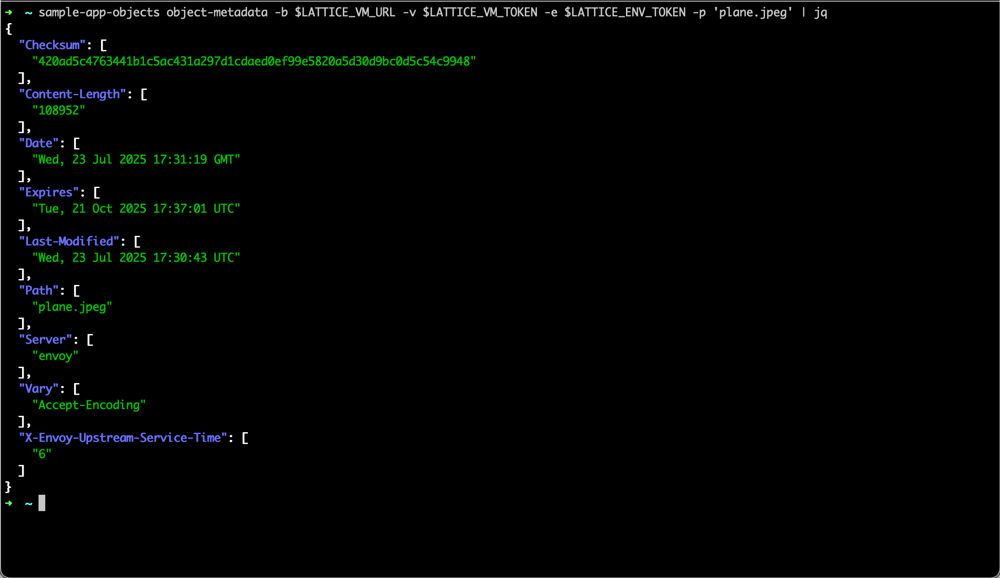

# Lattice Objects CLI



This CLI provides a set of operations for interacting with the Object Store.

## Features

- **Upload** a file with an optional Time-To-Live value.
- **Download** a file and save it to a specified location.
- **Delete** an object from the store.
- **Retrieve metadata** for a stored object.
- **List** objects in the store with an optional prefix filter.

## Requirements
- Go 1.23 (or higher)

## Installation

Ensure you have Go installed (Go 1.23+ required). Then run the following to build and run the `sample-app-objects` cli.
```
$ git clone git@github.com:anduril/sample-app-objects.git
$ cd sample-app-objects
$ go install
```


## Development

To run the sample app directly without building a binary:
```
$ go run main.go <command> [flags]
```

## Usage

Every command requires the following connection options:

- **-b, --base-url**: Base URL for the object store service.
- **-v, --lattice-vm-token**: Lattice VM authorization token.
- **-e, --lattice-env-token**: Lattice environment token.

The CLI supports five subcommands: **delete**, **upload**, **object-metadata**, **get**, and **list**.

### Command List

#### Delete

Remove a file or object from the object store.

Usage:
```
$ sample-app-objects delete -b <base-url> -v <lattice-vm-token> -e <lattice-env-token> -p <path>
```

Example:
```
$ sample-app-objects delete -b lattice-00000.env.sandboxes.developer.anduril.com -v my-vm-token -e my-env-token -p some/path/to/object
```

#### Upload

Upload a file to the object store. Optionally, specify a TTL (time-to-live) for the object.

Usage:
```
$ sample-app-objects upload -b <base-url> -v <lattice-vm-token> -e <lattice-env-token> -i <input-file-path> -p <object-store-path> [-t <time-to-live>]
```
Example:
```
$ sample-app-objects upload -b lattice-00000.env.sandboxes.developer.anduril.com -v my-vm-token -e my-env-token -i ./localfile.txt -p object/file.txt -t 2h
```

> The `-t` flag accepts duration strings (e.g., "2h", "30m").

#### Object Metadata

Retrieve metadata for a specific object.

Usage:
```
$ sample-app-objects object-metadata -b <base-url> -v <lattice-vm-token> -e <lattice-env-token> -p <path>
```

Example:
```
$ sample-app-objects object-metadata -b lattice-00000.env.sandboxes.developer.anduril.com -v my-vm-token -e my-env-token -p my-prefix/file.txt
```

#### Get

Download an object from the store and save it to a local file.

Usage:
```
$ sample-app-objects get -b <base-url> -v <lattice-vm-token> -e <lattice-env-token> -p <object-store-path> -o <output-file-path> [-r]
```

- **-p, --object-store-path**: Path in the object store to download.
- **-o, --output-path**: Local file path where the downloaded content will be saved.
- **-r, --replace-output-path**: If set, it replaces the existing output file with the downloaded contents.

Example:
```
$ sample-app-objects get -b lattice-00000.env.sandboxes.developer.anduril.com -v my-vm-token -e my-env-token -p my-prefix/file.txt -o ./downloaded.txt
```

#### List

List objects stored in the object store. Optionally filter results by a prefix.

Usage:
```
$ sample-app-objects list -b <base-url> -v <lattice-vm-token> -e <lattice-env-token> [prefix]
```

If a prefix is provided, only objects with that prefix will be listed.

Example:

```
$ sample-app-objects list -b lattice-00000.env.sandboxes.developer.anduril.com -v my-vm-token -e my-env-token my/prefix
```
